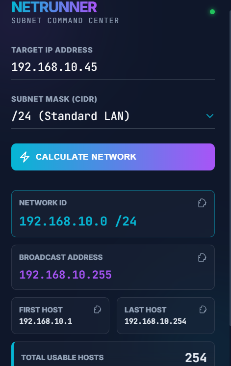

# NetRunner: Next-Gen Subnet Calculator

<strong>A Cyberpunk aesthetic subnet calculator for modern Network Engineers.</strong>

NetRunner is a Google Chrome Extension designed to simplify IPv4 subnet calculations without leaving your browser tab. Built with a focus on UX/UI using a modern **Glassmorphism** design language, it provides a "Command Center" feel for network troubleshooting and design.

## Preview

<em>The sleek, modern interface of NetRunner in action.</em>

## Features

* **Real-time Calculation:** Instant calculation of Network ID, Broadcast Address, and Host ranges.
* **Smart CIDR Selection:** Custom-built smooth dropdown handling /32 to /1 masks with descriptive labels.
* **Cyberpunk UI:** High-tech glassmorphism effects, neon accents, and responsive layout.
* **One-Click Copy:** Quick copy buttons for all calculated network parameters.
* **Privacy Focused:** Works 100% offline, ensuring no data ever leaves your machine.

## Installation

1. **Download** or clone this repository to your local machine.
2. Open Google Chrome and navigate to `chrome://extensions/`.
3. Enable **Developer Mode** using the toggle in the top right corner.
4. Click the **Load Unpacked** button.
5. Select the `NetRunner` folder containing the project files.

## 💻 Tech Stack

* **Frontend:** HTML5, CSS3 (Custom Variables & Flexbox/Grid)
* **Logic:** Vanilla JavaScript (ES6+ Bitwise Operations)
* **Manifest:** Chrome Extension API Manifest V3

---

### 👨‍💻 Author

**Murat Efe Nalbant** *Computer Engineering Student & Network Engineering Enthusiast*

---
